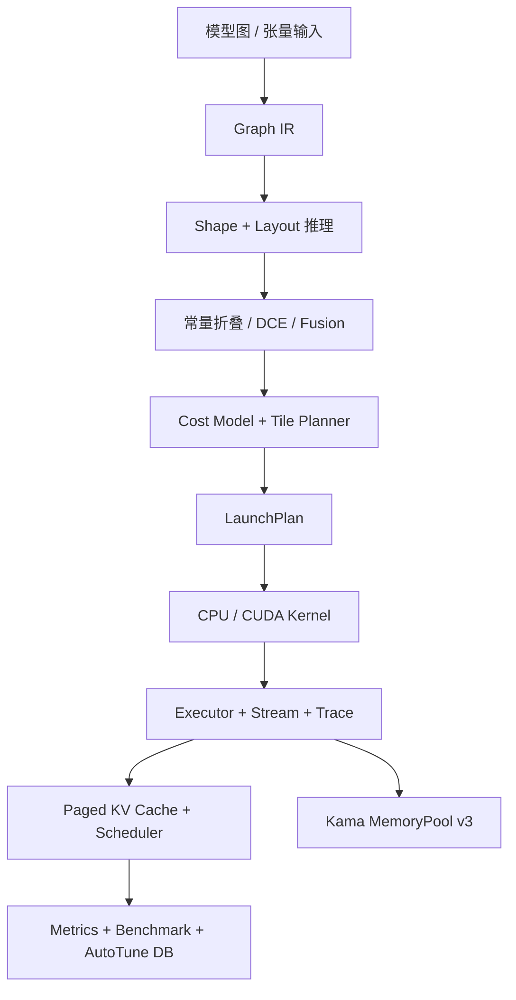

<!-- markdownlint-disable MD013 MD060 -->

# GPUForge

GPUForge 是一个 C++17/CUDA AI 基础设施项目，将计算图编译、GPU 算子、Transformer 推理运行时、内存池、调度和性能观测组织为一条可构建、可测试的工程链路。

## 项目介绍

项目围绕三条路径实现：

- **编译与规划**：图 IR、Shape/Layout 推理、常量折叠、死代码删除、融合、代价模型和 LaunchPlan。
- **算子与执行**：CPU 参考实现、CUDA Tiled FP32 GEMM、WMMA Tensor Core GEMM、Attention、Softmax 和 LayerNorm。
- **推理运行时**：Paged KV Cache、Prefill/Decode 调度、连续批处理、执行器、Trace、Metrics 和自动调优。

内嵌的 Kama MemoryPool v3 提供线程本地缓存、中央缓存和页缓存，并通过 `gpuforge::MemoryPool` 适配到运行时。通信层包含 AllReduce、AllGather、ReduceScatter 和 Broadcast 的规划接口。

## 架构



```text
include/gpuforge/     公共 C++ 接口
src/                  CPU 算子、编译、运行时、调度与观测实现
cuda/                 CUDA 与 WMMA Kernel
examples/             GEMM 基准程序
tests/                核心集成与边界测试
vendor_memorypool/v3/ Kama MemoryPool SDK
.github/workflows/    Linux CPU、ASan 和 CUDA 编译 CI
```

## 构建与运行

需要 CMake 3.18+、C++17 编译器；CUDA 路径还需要 CUDA Toolkit。无 CUDA 环境会保留 CPU fallback。

```bash
# CPU
cmake -S . -B build -DGPUFORGE_ENABLE_CUDA=OFF -DGPUFORGE_BUILD_TESTS=ON
cmake --build build --config Release --parallel
ctest --test-dir build -C Release --output-on-failure

# CUDA
cmake -S . -B build-cuda -DGPUFORGE_ENABLE_CUDA=ON \
  -DGPUFORGE_BUILD_TESTS=ON -DCMAKE_CUDA_ARCHITECTURES=89
cmake --build build-cuda --config Release --parallel
ctest --test-dir build-cuda -C Release --output-on-failure
```

运行 256 x 256 x 256 GEMM 基准：

```bash
./build-cuda/Release/gpuforge-bench 256 256 256 5
```

Windows 多配置生成器使用 `--config Release`；Linux 的单配置生成器可忽略该选项。基准输出包含 CPU 和可用 CUDA 路径的平均延迟、GFLOP/s 及自动选择的 kernel 配置。

## 测试覆盖

`gpuforge-test` 包含 18 个集成和边界场景，覆盖：

- Tensor/GEMM 数值正确性、随机 GEMM 参考比对、Softmax 稳定性、LayerNorm 参数校验，以及非方形 Attention。
- CUDA 可用时的 GEMM 与 Attention CPU/GPU 一致性；无 CUDA 时该路径自动跳过。
- Paged KV Cache 的跨页读写、位置映射、容量耗尽和 sequence 回收。
- 内存池并发分配、对齐、容量拒绝和完整释放。
- Prefill/Decode 调度、取消、批规划，Trace JSON 转义和 Metrics 聚合。
- Graph/IR 校验、Shape 合法性、算子元数、编译诊断、常量折叠、DCE、Fusion/Tile 规划与 Launch Report。

CI 在 Ubuntu 22.04 执行 CPU 构建、CTest 和 benchmark smoke，同时执行 AddressSanitizer；另以 CUDA 12.4.1 容器进行 CUDA 构建与编译期测试。

## 性能数据

所有数字均为本地实测记录，不应外推到不同硬件、驱动、功耗模式或后台负载。GPUForge 算子基准与内嵌内存池基准测量的是不同组件，以下分开报告。

### GPUForge Windows CUDA GEMM

环境：Windows 10、Visual Studio 2022 / MSVC 19.44、CMake 4.4.2、CUDA 12.5、NVIDIA GeForce RTX 4060 Laptop。配置为 256 x 256 x 256 FP32 GEMM，5 次迭代。

| 后端 | 平均延迟 | 吞吐 |
|---|---:|---:|
| CPU reference | 48.5712 ms | 0.690829 GFLOP/s |
| CUDA Tiled | 0.58876 ms | 56.9917 GFLOP/s |

该记录包含完整基准调用路径，不是独立 kernel-only 计时；同一配置下 CUDA Tiled 相对 CPU reference 约为 82 倍。GPUForge 当前没有可提交的 Linux GPU 实测记录，Linux CI 只验证 CPU、ASan 和 CUDA 编译/测试路径。

### Kama MemoryPool v3

GPUForge 使用的内嵌内存池 v3 已在 Release、统计关闭、Debug Guards 关闭的条件下分别记录 Windows 和 Linux 数据。各场景多次运行取中位数，单位为毫秒。

| 平台 / 场景 | v3 | new/delete | malloc/free |
|---|---:|---:|---:|
| Windows / 32B x 100000 | 2.564 | 5.395 | 5.401 |
| Windows / 4 线程 x 25000 | 3.069 | 5.596 | 5.937 |
| Windows / 16B-2048B 混合 x 50000 | 4.700 | 13.978 | 15.357 |
| Windows / 跨线程释放，64B x 50000 | 2.129 | 2.587 | 2.313 |
| Linux Ubuntu 22.04 / 32B x 100000 | 2.683 | 4.120 | 4.013 |
| Linux Ubuntu 22.04 / 4 线程 x 25000 | 3.977 | 4.032 | 2.374 |
| Linux Ubuntu 22.04 / 16B-2048B 混合 x 50000 | 2.832 | 8.398 | 7.876 |
| Linux Ubuntu 22.04 / 跨线程释放，64B x 50000 | 1.751 | 1.405 | 1.199 |

Linux 内存池记录中的 `reservedBytes=67534848`、`cachedPageBytes=65175552`，页缓存上限为 64 MiB。Linux 的多线程和跨线程释放在该记录中可能落后于 glibc；性能结论应以目标机器复测为准。`vendor_memorypool/v3/Dockerfile.linux_perf` 可用于复现实验环境，但不是自动 CI 工作流。

## 后续方向

- 扩展通用图执行和端到端执行器，将现有 LaunchPlan、内存规划与运行时调度串联为完整执行路径。
- 补齐独立 CUDA Softmax、LayerNorm 和更广泛的 GEMM/Attention kernel，并持续完善自动调优数据库。
- 接入完整的通信后端与计算/通信重叠执行，推进多 GPU 训练和推理场景。
- 建立跨 Linux/Windows、不同 GPU 和固定功耗配置的持续性能回归，补充 Linux GPU 端到端实测数据。
- 完善生产级资源隔离、错误恢复、可观测性和压力测试。

内存池分配返回的指针必须通过其对应接口释放，不能与 `free` 或 `delete` 混用。
